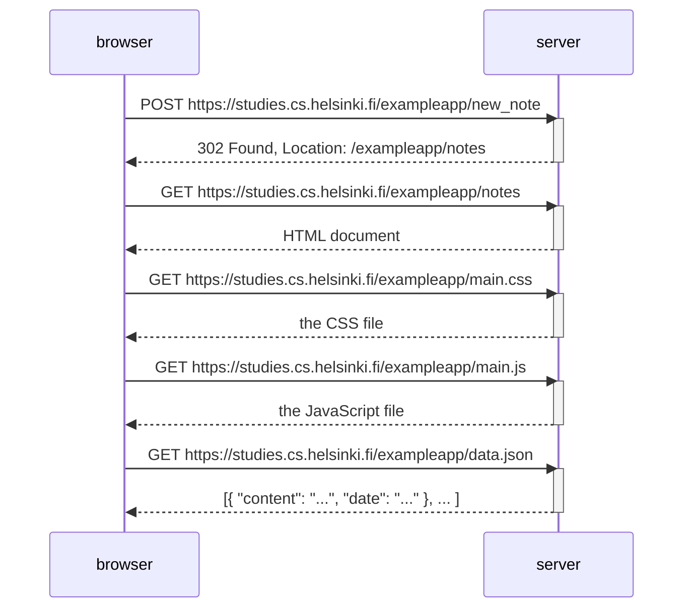

# Exercise 0.4: New note diagram

> Create a diagram depicting the situation where the user creates a new note on page
> https://studies.cs.helsinki.fi/exampleapp/notes by writing something into the text
> field and clicking the *Save* button.

## How to work it out

1. Open the page, open devtools → **Network** tab, tick **Preserve log** and **Disable cache**.
2. Type a note, hit Save.
3. Every row that appears is one arrow in your diagram. For each one note the
   **method**, the **URL**, the **status code**, and what came back.
4. Watch for the status code on the first request — it explains why the rows after it exist.

## My diagram

