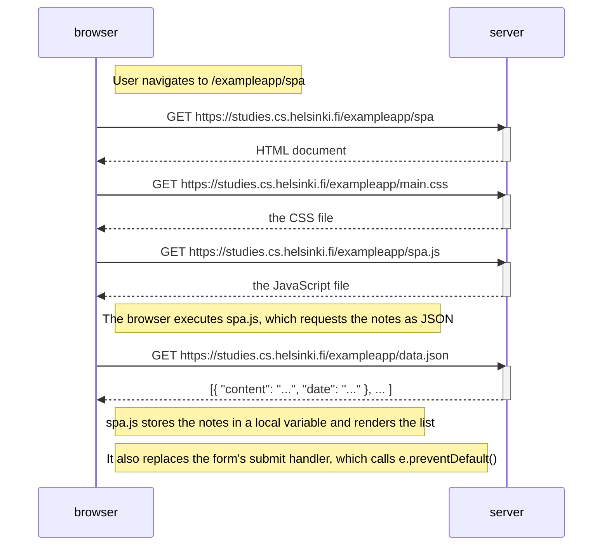

# Exercise 0.5: Single page app diagram

> Create a diagram depicting the situation where the user goes to the single page app
> version of the notes app at https://studies.cs.helsinki.fi/exampleapp/spa.

## How to work it out

1. Load the SPA URL with the Network tab open.
2. List the requests in order. Compare them to what the traditional page loaded —
   which files are the same, which one is different?
3. Open the JS file the server returns and read what it does after the data arrives.

## My diagram

