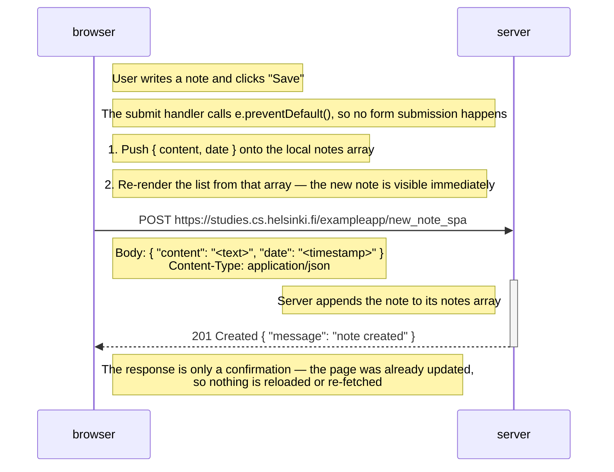

# Exercise 0.6: New note in single page app diagram

> Create a diagram depicting the situation where the user creates a new note using the
> single page version of the app.

## Notes

The submit handler installed by `spa.js` calls `e.preventDefault()`, so the browser never
performs a form submission and never navigates. Instead the handler updates the page from
its own in-memory copy of the notes *first*, and only then sends the note to the server as
JSON in the background.

The server replies `201 Created` with a short JSON confirmation. Nothing is done with that
response — the UI was already correct before it arrived. No HTML, CSS, JavaScript or
`data.json` is re-fetched, and the page is never reloaded.

## My diagram

