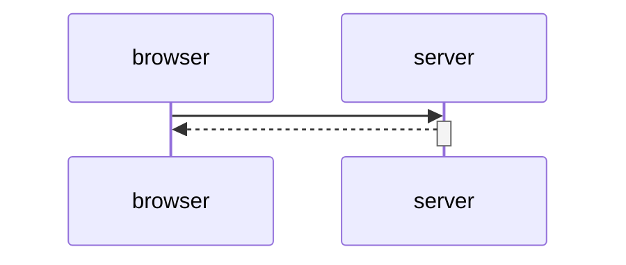

# Exercise 0.6: New note in single page app diagram

> Create a diagram depicting the situation where the user creates a new note using the
> single page version of the app.

## How to work it out

1. On the SPA page, add a note with the Network tab open.
2. Notice how few requests there are compared to 0.4 — and what the browser did to the
   list *before* any request went out.
3. Inspect the request's **Payload** and **Content-Type**, and the status code that
   comes back.
4. Your diagram should show the local steps too, not just the network ones — use
   `Note right of browser:` for those.

## My diagram

